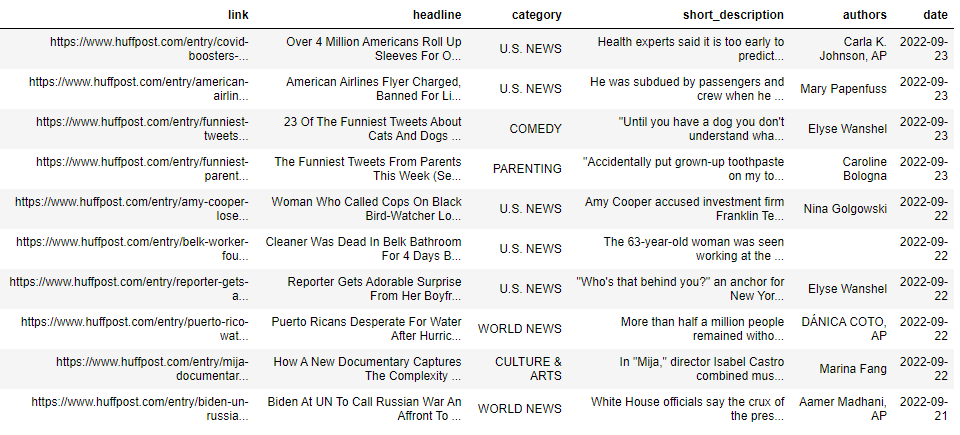
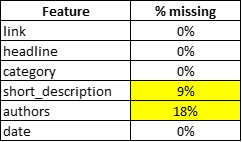
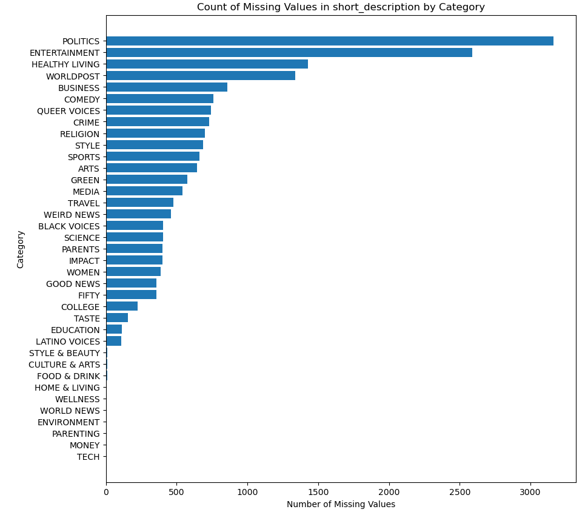
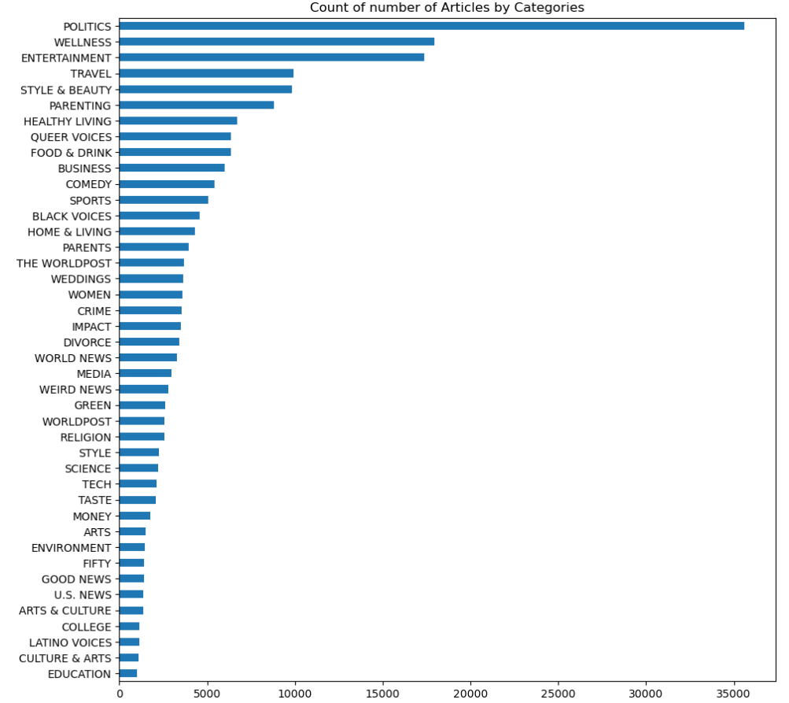
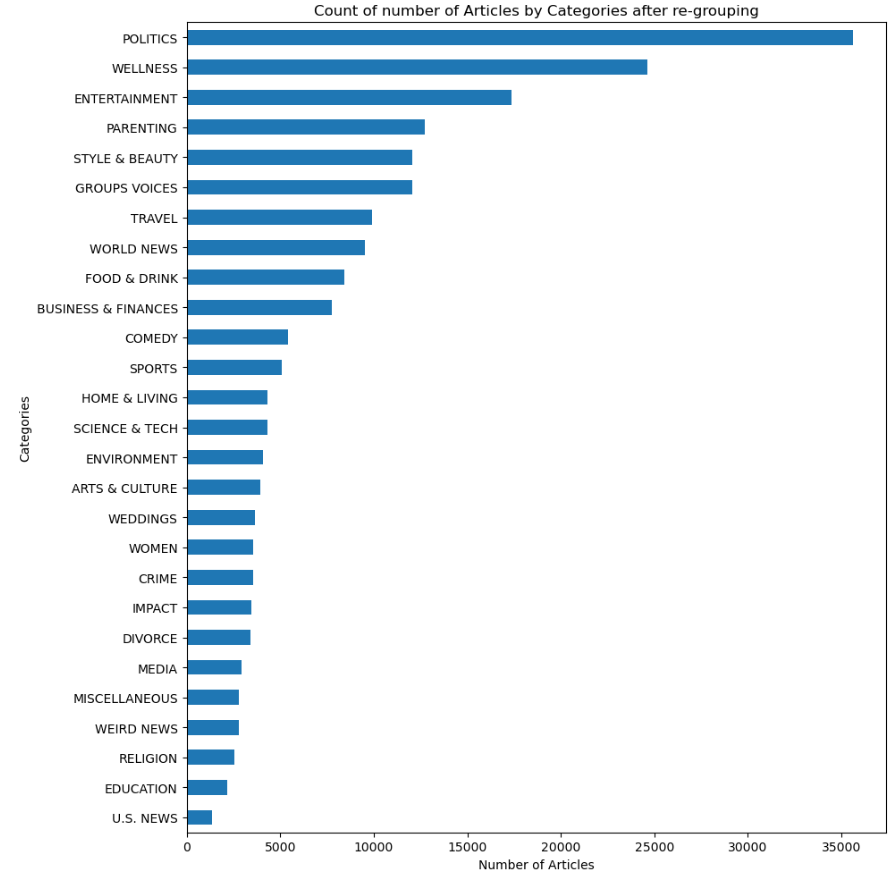
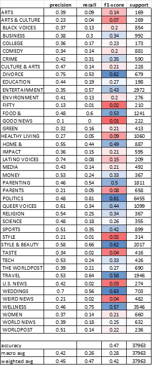

# Contextual Ads Redefined: Data Science Strategies for Privacy-Driven Advertising

 

### The Problem area: 

How can we use machine learning to help advertisers reach their target audiences in the digital marketing world post cookie depreciation? Google and other major digital tech companies are going through a transition in finding better ways to help brands connect with their potential customers in a privacy centric way.

 

### The User: 

Advertisers, Publishers, and Customers will be impacted when cookies and mobile IDs go away. Customers will see ads that are totally irrelevant, Advertisers would experience low ROI when there is no efficient targeting methods and finally Publishers will start losing dollars since they can’t connect advertisers and users effectively.

 

### The Big Idea:  

What if there is a way to understand/classify the content that the user is interacting? This signal can then be capitalized to serve ads effectively, especially in a world where there is no personal identifiers (cookies, Mobile IDs). Example: A user browsing through articles on travel is most likely going to make that trip and it would only make sense to show ads relevant travel ads next to those articles. 

 

### The Impact: 

Cookie depreciation or lack of user tracking tools can have huge impact at the industry level with losses projected up to $10 billion.
“..the Interactive Advertising Bureau estimates publishers' exposure at up to $10 billion in lost revenue without third-party cookies..” 

 

### Dataset:

For this project, I have selected "News Category Dataset" dataset from [Kaggle](https://www.kaggle.com/datasets/rmisra/news-category-dataset) which contains around 210k news headlines from 2012 to 2022 published in HuffPost. This is one of the biggest news datasets and can serve as a benchmark for a variety of computational linguistic tasks. HuffPost stopped maintaining an extensive archive of news articles sometime after this dataset was first collected in 2018, so it is not possible to collect such a dataset in the present day. Due to changes in the website, there are about 200k headlines between 2012 and May 2018 and 10k headlines between May 2018 and 2022.

 

### Data Dictionary:

| Feature      | Description                               |
|:--------------------|:------------------------------------------|
| category          | Category in which the article was published. |
| headline          | The headline of the news article.         |
| authors           | List of authors who contributed to the article. |
| link              | Link to the original news article.       |
| short_description | Abstract of the news article.            |
| date              | Publication date of the article.         |

 

### Sneak Peek Into The Dataset:

### EDA:

There are about 9% missing data in the `short description` and 18% in `author`.

Here is the graph showing the number of missing short description by category:

There are 19,712 rows with missing `short_description`. Unlike numerical data, it would be hard to impute.

 

Frequency distribution of article categories:

As we can see in the plot above, there are 42 unique categories and the number of articles are really unbalanced with about 1/6th of the total articles coming from 'Politics'. Also, there are categories that are similar in themes that are separated and we could try to group them together. For instance, `Science` and `Tech` are listed separately and we can create a category named `Science and Tech`

 

 
Let's look at the article distribution after re-grouping the categories. Now we have reduced it to 27 categories from 42.

 

## Pre-processing:

1. Remove rows with null values for short_description and categories

2. Custom-Tokenizer  
i. remove punctuation and set to lower case  
ii. remove digits using list comprehension  
iii. remove html tags  
iv. remove stopwords and any tokens that are just empty strings  

3. Tokenization  
i. CountVectorization: min_df = 20  
ii. TF-IDF: max_features=5000

## Baseline Model -Logistic Regression:

1. CountVectorizer  
    i. using custom tokenizer  
    Train score: 61.4%  
Test score: 45.7%

    ii. using custom vectorizer and upsampling "train set"  
    Train score: 84.8%  
Test score: 36.8%

2. TF-IDF  
    i. using custom tokenizer  
    Train score: 52.0%  
Test score: 46.7%

    ii. using custom vectorizer and upsampling "train set"  
    Train score: 66.5%  
Test score: 33.4%

## Classification report for the best model so far:

TF-IDF using custom tokenizer resulted in the test accuracy score of 46.7%  

## Advanced Modeling:

1. BERT - Tensorflow NN:  
    Train score: 42.3%  
Test score: 44.7%

## Next steps:

i. Improve pre-processing by finding better ways to tokenize and remove noisy words/characters.  
ii. Work with hyperparameters to see if the results get better.